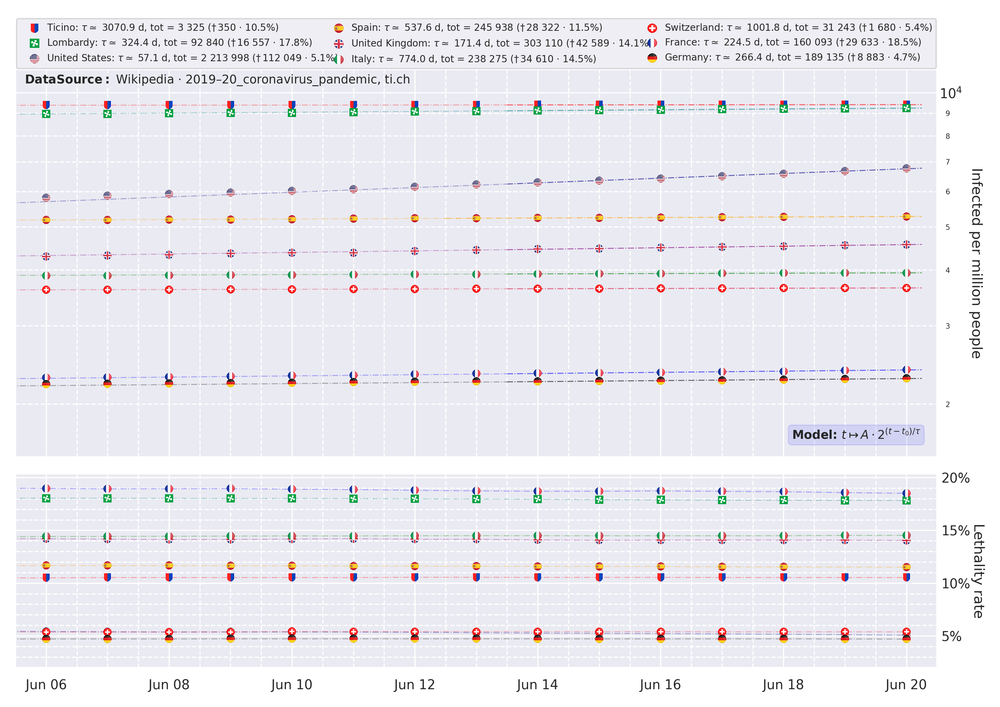

# Coronavirus Analysis
Coronavirus outbreak by (most infected) countries

---------------------------------------------------
[EN] This script is my personal analysis of the most infected countries
because of the 2019-20 coronavirus outbreak.

The data are taken from
- https://en.wikipedia.org/wiki/COVID-19_pandemic_by_country_and_territory
- http://www.protezionecivile.gov.it/
- https://www4.ti.ch/dss/dsp/covid19/home/
- https://www.bag.admin.ch

This script is created for a didactic use and it is not intended to be a
true interpretation of the current events.

---------------------------------------------------
[IT] Questo script è la mia analisi personale della diffusione del virus
Covid-19 nei paesi più esposti all'infezione.

I dati sono stati recuperati da
- https://en.wikipedia.org/wiki/COVID-19_pandemic_by_country_and_territory
- http://www.protezionecivile.gov.it/
- https://www4.ti.ch/dss/dsp/covid19/home/
- https://www.bag.admin.ch

Questo script è un esercizio di stile creato unicamente a scopo didattico e
non ha la pretesa di essere una interpretazione attendibile dell'attualità.
