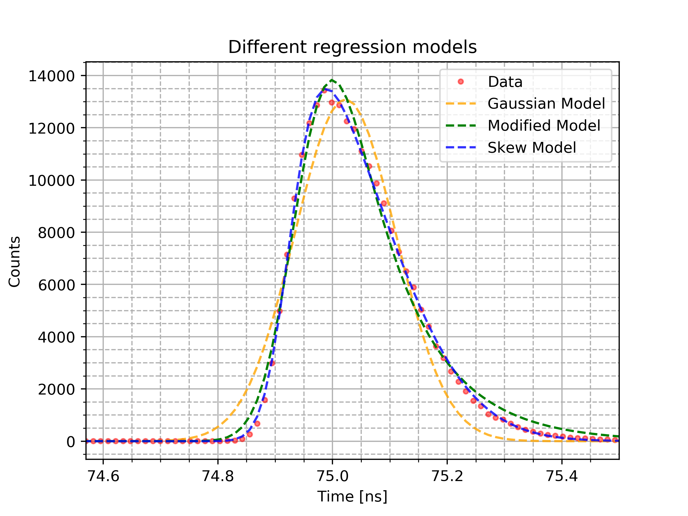
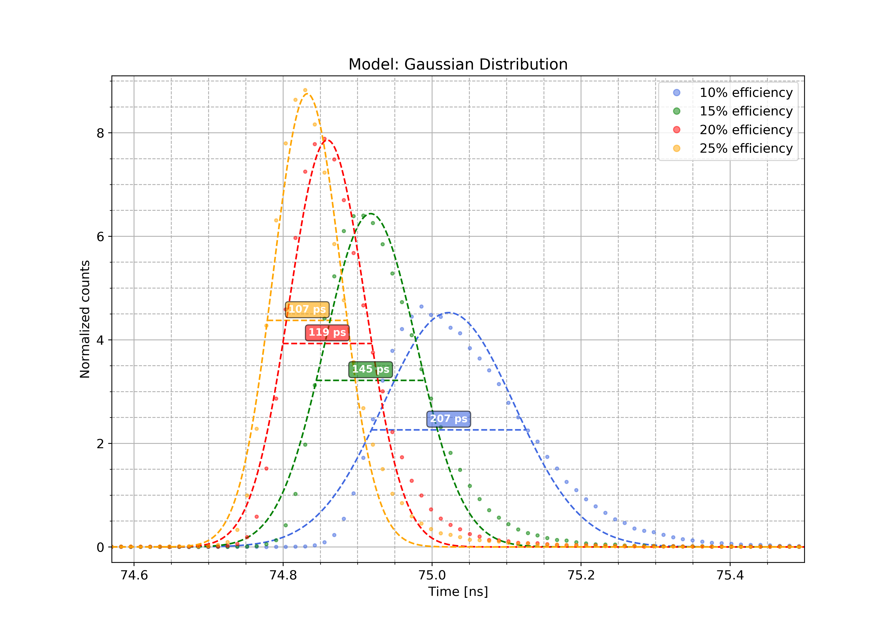

# Pseudo-Gaussian Fittings
Pseudo-Gaussian model of a diode signal

---------------------------------------------------
[EN] This script is my personal analysis of the diode signal using different
models
- Gaussian distribution
- Modified Gaussian distribution
- Skew-Gaussian distribution

This script is created for a didactic use and it is not intended to be a
true interpretation of the current events.

---------------------------------------------------
[IT] Questo script è la mia analisi personale del segnale di un diodo utilizzando
diversi modelli
- distribuzione Gaussiana
- distribuzione Gaussiana Modificata
- distribuzione Gaussiana Asimmetrica

Questo script è un esercizio di stile creato unicamente a
scopo didattico e non ha la pretesa di essere una interpretazione
attendibile dell'attualità.

