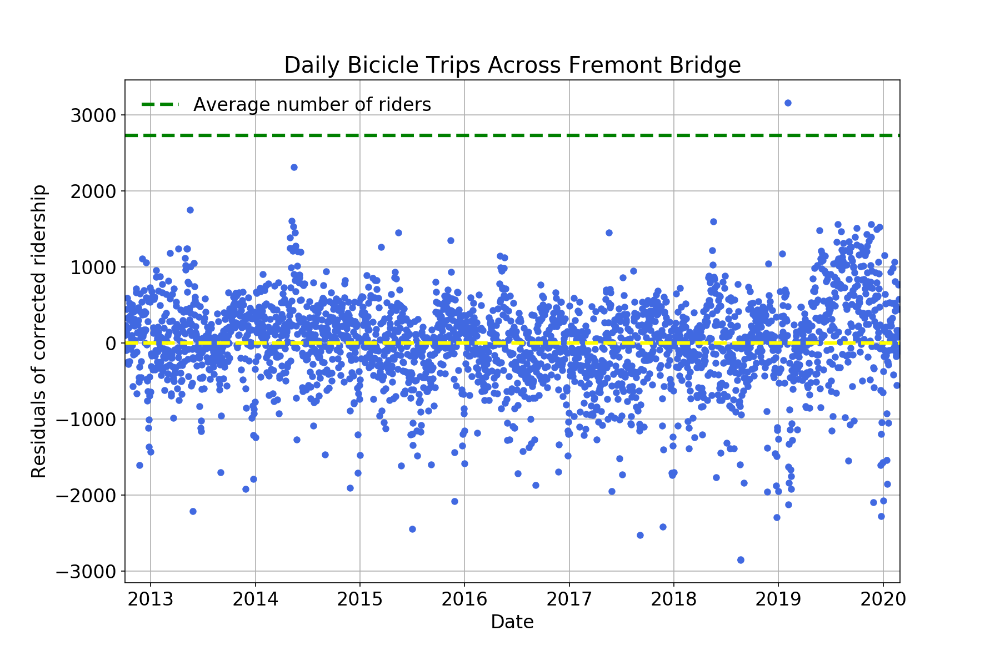

# Seattle Riders
Analysis of the increasing number of riders in Seattle

---------------------------------------------------
[EN] This script is my personal analysis of the increasing number of riders
including weather effects in Seattle in the period 2012-2020
using Machine Learning.

The data are taken from
- [Number of riders](https://data.seattle.gov/Transportation/Fremont-Bridge-Bicycle-Counter/65db-xm6k)
- [Weather data](https://www.ncdc.noaa.gov/cdo-web/search?datasetid=GHCND)

This script is created for a didactic use and it is not intended to be a
true interpretation of the current events.

---------------------------------------------------
[IT] Questo repository è la mia analisi personale dell'aumento del numero di
ciclisti, includendo gli effetti metereologici, in Seattle nel periodo 2012-20t
usando l'Apprendimento Automatico.

I dati sono stati recuperati da
- [Numero di ciclisti](https://data.seattle.gov/Transportation/Fremont-Bridge-Bicycle-Counter/65db-xm6k)
- [Valori metereologici](https://www.ncdc.noaa.gov/cdo-web/search?datasetid=GHCND)

Questo script è un esercizio di stile creato unicamente a
scopo didattico e non ha la pretesa di essere una interpretazione
attendibile dell'attualità.
