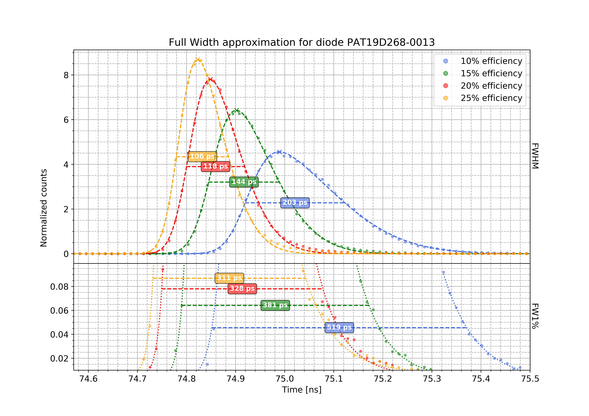

# Skew-Gaussian Analysis of diodes
Skew-Gaussian Analysis of multiple diodes with different efficiencies

---------------------------------------------------
[EN] This script is my personal analysis of multiple diodes with different
efficiencies using the model of a Skew-Gaussian distribution.

This script is created for a didactic use and it is not intended to be a
true interpretation of the current events.

---------------------------------------------------
[IT] Questo script è la mia analisi personale di diversi diodi variando
l'efficienza utilizzando la distribuzione Gaussiana Asimmetrica.

Questo script è un esercizio di stile creato unicamente a
scopo didattico e non ha la pretesa di essere una interpretazione
attendibile dell'attualità.
