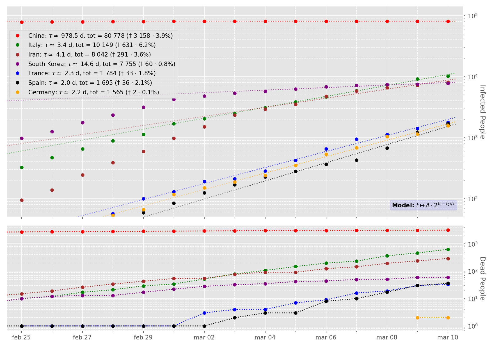

# Coronavirus Analysis
Coronavirus outbreak by (most infected) countries

---------------------------------------------------
[EN] This repository is created as a personal container to publish the python
script of my personal Covid-19 analysis of the most infected countries.

The data are taken from Wikipedia
https://en.wikipedia.org/wiki/2019%E2%80%9320_coronavirus_outbreak

This script is created for a didactic use and it is not intended to be a
true interpretation of the current events.

---------------------------------------------------
[IT] Questo repository è stato creato come spazio personale dove pubblicare
la mia analisi basata su python della diffusione del virus Covid-19 nei
paesi più infettati.

I dati sono stati recuperati da Wikipedia
https://en.wikipedia.org/wiki/2019%E2%80%9320_coronavirus_outbreak

Questo script è un esercizio di stile creato unicamente a
scopo didattico e non ha la pretesa di essere una interpretazione
attendibile dell'attualità.

---------------------------------------------------
- The 'datasets' directory contains the data about infected/dead people for different countries
- The script is coronavirus.py
- The output plot is coronavirus.png
