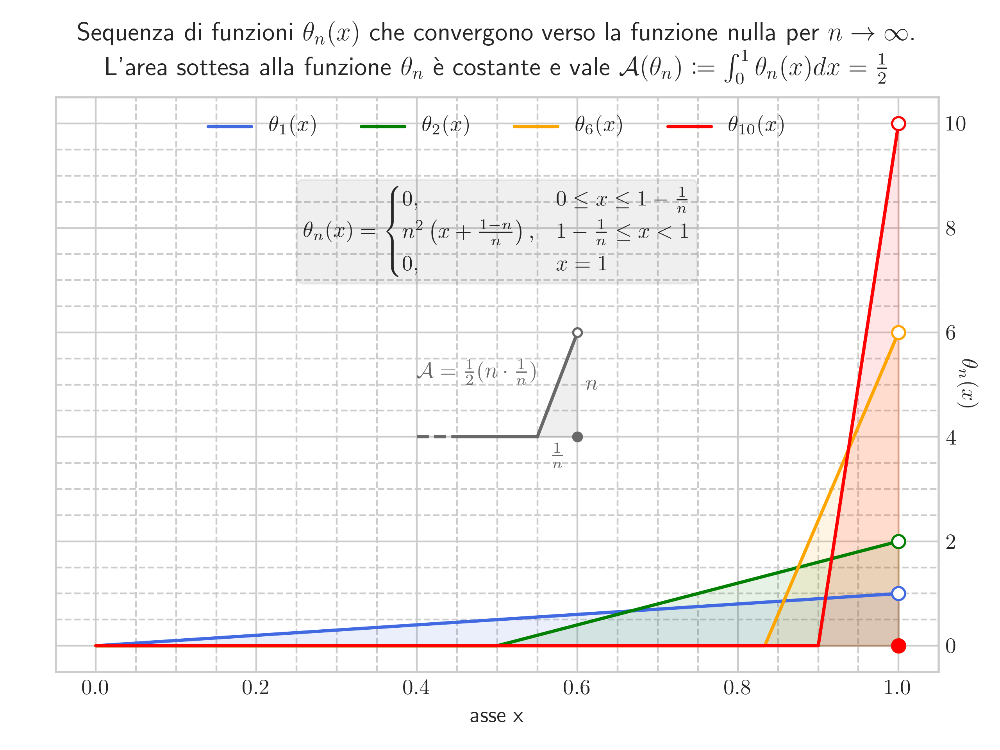

# Convergenza Uniforme
Esempio di convergenza non uniforme

---------------------------------------------------
[IT] Questo script è stato creato a scopo didattico per evidenziare come non sia
garantito che il limite di una funzione è la funzione del limite quando la
continuità non è uniforme
